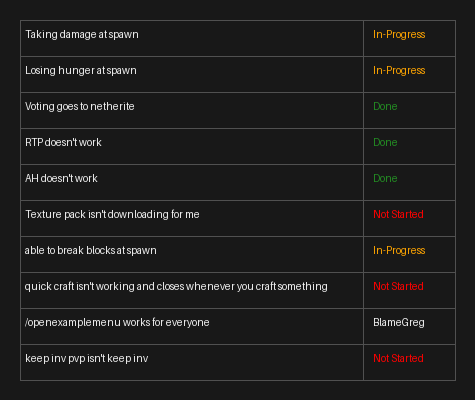

# TaskView
This tool reads a JSON task list and outputs a formatted checklist in **text-based ASCII** and **image-based PNG** formats. It's useful for tracking server setup steps, development milestones, or deployment sequences — particularly in environments like Discord or GitHub.

---

## Features

- Generates a monospaced **ASCII-style checklist** suitable for Discord or terminals
- Creates a **visual PNG checklist** ideal for sharing on GitHub or embedding in documents
- Fully customizable — just modify `task.json`

---

## How to Use

1. Create a `task.json` file with a structure like this:

```json
[
  {"task": "Wait for stable paper release", "status": "Good Enough"},
  {"task": "Check plugin update statuses", "status": "Not Started"},
  ...
]
```
---

## Example Outputs
<details>
    <summary>Text Based Markdown</summary>

    ┌───────────────────────────────────────────────────┬─────────────┐
    │ Task                                              │ Status      │
    ╞═══════════════════════════════════════════════════╪═════════════╡
    │ Wait for stable paper release                     │ Good Enough │
    ├───────────────────────────────────────────────────┼─────────────┤
    │ Check plugin update statuses                      │ Not Started │
    ├───────────────────────────────────────────────────┼─────────────┤
    │ Download all plugins and server jar               │ Not Started │
    ├───────────────────────────────────────────────────┼─────────────┤
    │ Confirm test server launches and all plugins load │ Not Started │
    ├───────────────────────────────────────────────────┼─────────────┤
    │ Move test server to new host                      │ Not Started │
    ├───────────────────────────────────────────────────┼─────────────┤
    │ Worldborder set to 15K radius                     │ Not Started │
    ├───────────────────────────────────────────────────┼─────────────┤
    │ Run world pregen plugin                           │ Not Started │
    ├───────────────────────────────────────────────────┼─────────────┤
    │ Create a spawn                                    │ Not Started │
    ├───────────────────────────────────────────────────┼─────────────┤
    │ Add rules, ranks, and other information to spawn  │ Not Started │
    ├───────────────────────────────────────────────────┼─────────────┤
    │ Create spawn protection                           │ Not Started │
    ├───────────────────────────────────────────────────┼─────────────┤
    │ Set up creative world                             │ Not Started │
    ├───────────────────────────────────────────────────┼─────────────┤
    │ Setup creative spawn protection                   │ Not Started │
    ├───────────────────────────────────────────────────┼─────────────┤
    │ Enable datapacks (scoreboards)                    │ Not Started │
    ├───────────────────────────────────────────────────┼─────────────┤
    │ Create zip of old version for archive             │ Not Started │
    ├───────────────────────────────────────────────────┼─────────────┤
    │ Remove old playerdata from plugins                │ Not Started │
    ├───────────────────────────────────────────────────┼─────────────┤
    │ Edit gamerules                                    │ Not Started │
    ├───────────────────────────────────────────────────┼─────────────┤
    │ Remove whitelist and make announcement of update  │ Not Started │
    └───────────────────────────────────────────────────┴─────────────┘

</details>

<details>
 <summary>Image Based Checklist</summary>
 
</details>

